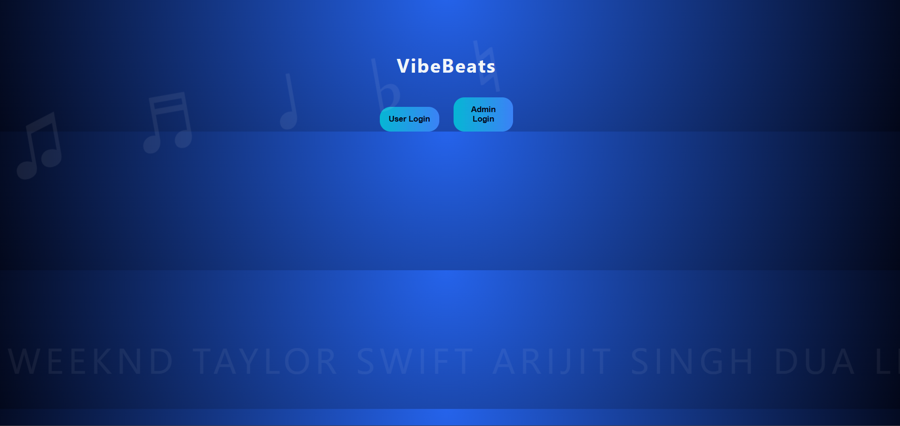
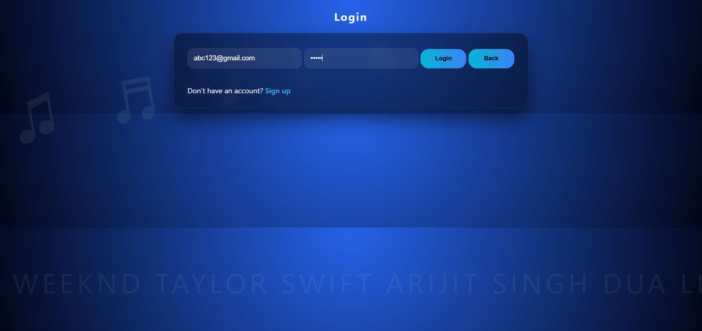
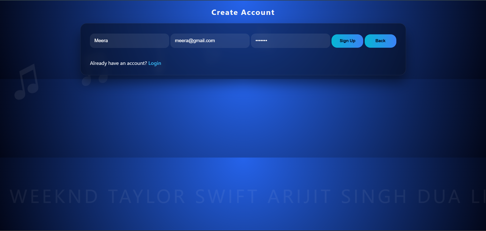
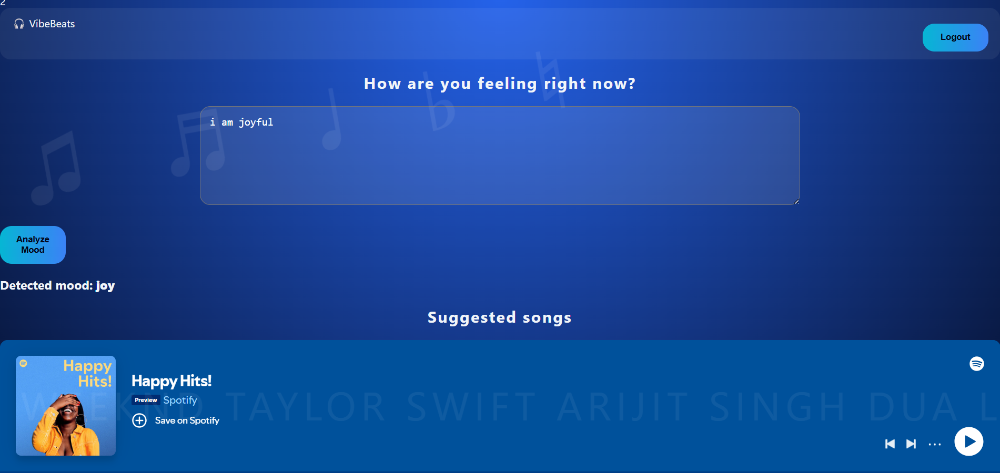
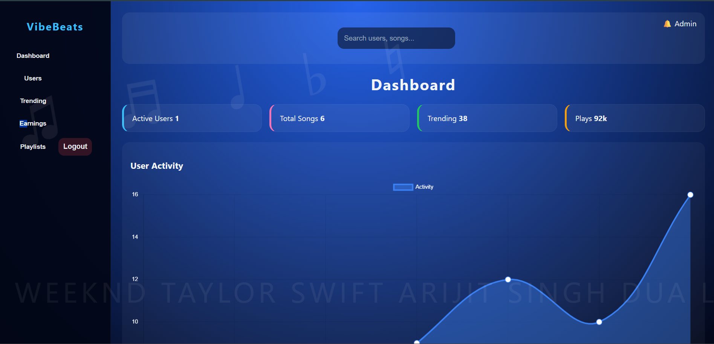
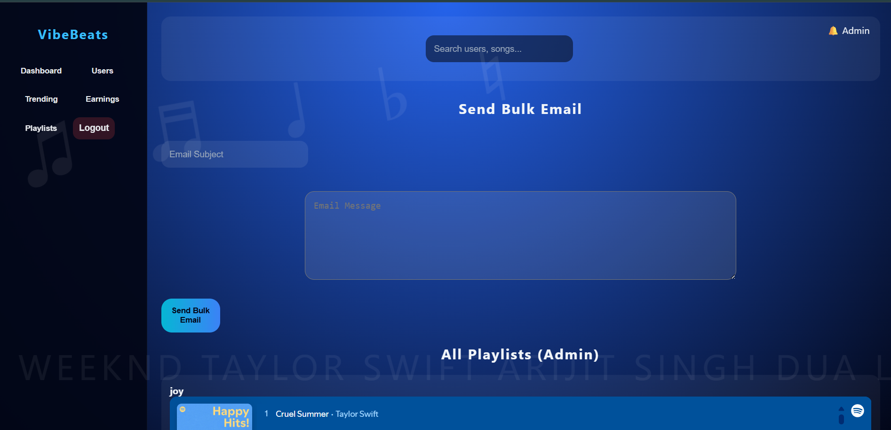

# 🎵 VibeBeats

### AI-Powered Mood-Based Music Recommendation Platform

---

VibeBeats is a full-stack intelligent music recommendation platform that combines:

- **Artificial Intelligence**
- **Natural Language Processing**
- **Spotify Integration**
- **Redis Caching**
- **Celery Distributed Task Processing**
- **MongoDB**
- **Bulk Email Automation**

The platform delivers personalized music experiences based on a user's emotional state.

Instead of manually searching for songs, users can describe how they feel in natural language. VibeBeats analyzes the emotional context using an AI model and generates a personalized music experience around the detected mood.

---
## ✨ Why VibeBeats?

Traditional music applications primarily depend on listening history, likes, playlists, and search behavior.

VibeBeats introduces an additional dimension: **the user's current emotional state.**

> ***"Tell us how you feel, and we'll find the music that matches your mood."***

For example, a user can enter:

```text
"I've had a really stressful day and just want something calm."
```
---
## 🚀 Key Features

### 🤖 AI-Based Emotion Detection

- Accepts natural-language descriptions of the user's mood.
- Uses a Hugging Face emotion classification model.
- Detects emotions from user input.
- Maps detected emotions to suitable music moods.
- Generates mood-based music recommendations.

### 🎧 Music Recommendation

- Integrates with Spotify for music discovery.
- Retrieves songs and playlists based on the detected mood.
- Provides mood-oriented music recommendations.
- Supports personalized music discovery based on the user's emotional state.

### ⚡ Redis Integration

Redis is integrated into the application to support fast and asynchronous processing.

- Redis is used as the message broker for Celery.
- Helps manage background tasks.
- Supports communication between the application and Celery workers.

### 🔄 Celery Distributed Task Processing

VibeBeats uses Celery with Redis for background task processing.

The implemented background tasks include:

- AI emotion analysis
- Email processing
- Asynchronous operations

This allows long-running tasks to be handled separately from the main Node.js application.

### 📧 Bulk Email Processing

The application supports bulk email processing through Celery.

- Admin can compose a bulk email.
- Email requests are processed asynchronously.
- Celery workers handle email tasks in the background.
- This prevents bulk email processing from blocking the main application.

### 👤 User Management

The application supports user-oriented functionality including:

- User registration
- User login
- User authentication
- Personalized user dashboard
- Mood analysis
- Music recommendations

### 🛠️ Admin Functionality

The application provides administrative functionality including:

- Admin login
- User management
- Playlist management
- Trending music management
- Earnings-related information
- Bulk email management
- Administrative controls

---
## 💡 How It Works

| Step | Process |
|---|---|
| 1️⃣ | User describes their current mood |
| 2️⃣ | AI analyzes the emotional context |
| 3️⃣ | Detected emotion is mapped to a music mood |
| 4️⃣ | Music is retrieved based on the mood |
| 5️⃣ | User receives personalized recommendations |

### 🔄 Recommendation Flow

```text
User Input
    ↓
AI Emotion Detection
    ↓
Emotion → Mood Mapping
    ↓
Music Recommendation
    ↓
Personalized Vibe 🎧
```
---

## 🏗️ System Architecture

```text
                     ┌────────────────────┐
                     │      Frontend      │
                     │    React + Vite    │
                     └─────────┬──────────┘
                               │
                               │ HTTP / REST API
                               ▼
                     ┌────────────────────┐
                     │      Backend       │
                     │ Node.js + Express  │
                     └──────┬─────┬───────┘
                            │     │
            ┌───────────────┘     └────────────────┐
            │                                      │
            ▼                                      ▼
   ┌─────────────────┐                    ┌─────────────────┐
   │    MongoDB      │                    │      Redis      │
   │ Persistent Data │                    │ Message Broker  │
   └─────────────────┘                    └────────┬────────┘
                                                   │
                                                   ▼
                                         ┌──────────────────┐
                                         │      Celery      │
                                         │ Background Tasks │
                                         └────────┬─────────┘
                                                  │
                                  ┌───────────────┴───────────────┐
                                  │                               │
                                  ▼                               ▼
                          ┌───────────────┐              ┌────────────────┐
                          │ Hugging Face  │              │ Email Worker   │
                          │ Emotion Model │              │ Bulk Emails    │
                          └───────────────┘              └────────────────┘

                                  │
                                  ▼
                          ┌────────────────┐
                          │    Spotify     │
                          │ Music Services │
                          └────────────────┘
```

---
## 🧰 Technology Stack

| Layer | Technology |
|---|---|
| Frontend | React.js |
| Frontend Build Tool | Vite |
| Backend | Node.js |
| Backend Framework | Express.js |
| Database | MongoDB |
| ODM | Mongoose |
| Task Queue | Celery |
| Message Broker | Redis |
| AI / NLP | Hugging Face |
| Music Platform | Spotify |
| Email Processing | Python + Celery |
| Authentication | JWT / Application Authentication |
| API Communication | REST APIs |
| Version Control | Git + GitHub |

---
## 📁 Project Structure
```text
VibeBeats
│
├── backend
│   ├── models
│   ├── routes
│   ├── server.js
│   └── seedSongs.js
│
├── frontend
│   ├── index.html
│   ├── dashboard.html
│   ├── login.html
│   ├── signup.html
│   ├── adminDashboard.html
│   ├── dashboard.js
│   └── style.css
│
├── screenshots
├── README.md
└── package.json
```
> The exact contents of individual directories may evolve as the project is extended.
---
⚙️ Prerequisites
Before running VibeBeats, install:
Node.js
npm
Python 3.x
MongoDB
Redis
Git
You will also need accounts/API credentials for services used by the application, such as:
Hugging Face
Spotify
Email provider
---
📥 Installation
Follow these steps to install and set up VibeBeats locally.
1️⃣ Clone the Repository
```bash
git clone https://github.com/SindhuTingirkar/Vibe-Beats.git
cd Vibe-Beats
```
2️⃣ Install Node.js Dependencies
From the project root:
```bash
npm install
```
3️⃣ Install Frontend Dependencies
```bash
cd frontend
npm install
cd ..
```
4️⃣ Set Up Python Environment
Create a Python virtual environment for the Celery worker:
```bash
python -m venv api_worker/venv
```
Activate it on Windows:
```powershell
.\api_worker\venv\Scripts\Activate.ps1
```
Install the required Python packages:
```powershell
pip install -r api_worker/requirements.txt
```
---
▶️ Running the Application
VibeBeats uses multiple services. Run them in separate terminals and keep each service running while using the application.
1️⃣ Start MongoDB
If MongoDB is installed as a Windows service:
```powershell
net start MongoDB
```
Or start the MongoDB server according to your local installation.
2️⃣ Start Redis
```powershell
redis-server
```
Redis should be available at:
```text
localhost:6379
```
3️⃣ Start Celery Worker
From the project root:
```powershell
.\api_worker\venv\Scripts\Activate.ps1
celery -A api_worker.celery_app worker --loglevel=info --pool=solo
```
The worker should eventually display:
```text
celery@... ready.
```
4️⃣ Start Node.js Backend
Open another terminal:
```powershell
node backend/server.js
```
The backend runs on:
```text
http://localhost:5000
```
5️⃣ Start React Frontend
Open another terminal:
```powershell
cd frontend
npm run dev
```
Vite will provide a local URL similar to:
```text
http://localhost:5173
```
Open that URL in your browser.
---
🔌 Application Services
Service	Purpose	Default Address
React + Vite	User interface	`localhost:5173`
Node.js + Express	REST API	`localhost:5000`
MongoDB	Persistent database	`localhost:27017`
Redis	Cache + message broker	`localhost:6379`
Celery	Background processing	Worker process
---
🎯 Emotion Analysis
The emotion analysis pipeline works conceptually as:
```text
Text Input
↓
Preprocessing
↓
Hugging Face Emotion Model
↓
Emotion Prediction
↓
Mood Mapping
↓
Music Recommendation
```
For example:
```text
"I feel extremely happy today!"
↓
Emotion
↓
Joy
↓
Happy
↓
Music Recommendation
```
The exact emotion-to-mood mapping depends on the application's configured logic.
---
⚡ Why Redis + Celery?
Without Background Processing
```text
User Request
↓
Node.js
↓
AI Processing
↓
Email Processing
↓
Response
```
The user may have to wait for expensive operations to finish.
With Redis + Celery
```text
User Request
↓
Node.js
↓
Queue Task
↓
Immediate Response / Continued Processing
│
▼
Redis
│
▼
Celery Worker
│
├── AI Processing
└── Email Processing
```
This makes the architecture more suitable for applications that need to handle increasing workloads.
---
📧 Bulk Email Architecture
Bulk email operations are handled asynchronously.
```text
Admin / Application
│
▼
Email Request
│
▼
Redis
│
▼
Celery Email Worker
│
▼
Email Provider
│
▼
Recipient
```
This prevents bulk email operations from blocking normal API requests.
---
🗄️ Database
MongoDB is used for persistent application data.
Typical data categories may include:
Users
Authentication information
Music-related data
Playlists
Application activity
Recommendation-related information
Mongoose provides structured interaction between Node.js and MongoDB.
---
🧪 Testing the Application
After starting all services, verify:
Frontend loads at `http://localhost:5173`
Backend runs at `http://localhost:5000`
Redis accepts connections
Celery worker displays `ready`
Backend displays `MongoDB Connected`
---
🔮 Future Enhancements
The platform can be extended with:
🤖 Advanced AI
Multimodal emotion detection
Voice-based mood detection
Facial-expression analysis
Personalized recommendation models
User preference learning
Reinforcement-learning-based recommendations
🎵 Recommendation Engine
Listening-history-based recommendations
Collaborative filtering
Content-based filtering
Hybrid recommendation system
Personalized playlists
Daily mood playlists
📊 Analytics Dashboard
User engagement
Most detected emotions
Most popular moods
Recommendation success rate
Playlist engagement
User retention
System performance
☁️ Production Deployment
Potential deployment architecture:
```text
                    ┌───────────────┐
                    │    Users      │
                    └───────┬───────┘
                            │
                            ▼
                    ┌───────────────┐
                    │   Frontend    │
                    │   Deployment  │
                    └───────┬───────┘
                            │
                            ▼
                    ┌───────────────┐
                    │  Node Backend │
                    └───────┬───────┘
                            │
              ┌─────────────┼─────────────┐
              ▼             ▼             ▼
          MongoDB         Redis       External APIs
              │             │
              │             ▼
              │          Celery
              │             │
              │      ┌──────┴──────┐
              │      ▼             ▼
              │   AI Worker    Email Worker
              │
              └──────────┬──────────┘
                         ▼
                       Data
```
Possible production improvements include:
Docker containerization
CI/CD
Cloud deployment
Load balancing
Monitoring
Centralized logging
Redis Cluster
Horizontal worker scaling
Rate limiting
API security
Automated testing
---
📌 Development Workflow
The project follows a Git-based development workflow:
```bash
git status
git add .
git commit -m "Describe your changes"
git push
```
Before committing, always verify that sensitive files are excluded:
```bash
git status
```
---
📸 Screenshots
🏠 Home Page

🔐 Login

📝 User Sign Up

🧠 Mood Analysis

🛡️ Admin Login

🛠️ Admin Dashboard

📧 Bulk Email

---
👩‍💻 Author
Sindhu Tingirkar
GitHub: @SindhuTingirkar
---
📄 License
This project is currently intended for educational, research, and portfolio purposes.
---
💡 Project Vision
> ***VibeBeats transforms emotions into music by combining AI-powered emotion understanding with intelligent music discovery and scalable backend architecture.***
Feel it. Analyze it. Vibe with it.